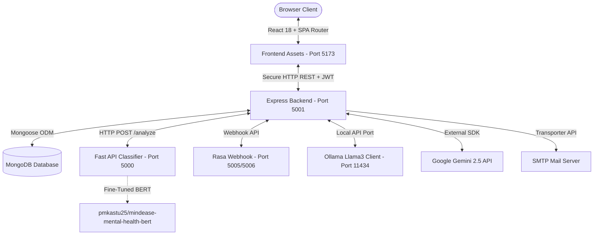

# 🌿 MindEase AI — Architectural Specifications & Setup Guide

MindEase AI is a modular, triple-tier web application designed to support personal emotional tracking, cognitive behavioral reflections, and immediate mental health resources. The system is built around a botanical design system utilizing glassmorphic components to offer a peaceful, low-friction user experience.

---
## Deployment:
* Vercel (Frontend): https://mind-ease-ai-git-main-acers1.vercel.app/
* Render (Backend): https://mindease-ai-k84e.onrender.com
* Hugging Face Spaces (ml-service): https://pmkastu25-mindease-ml-service.hf.space
* Hugging Face Spaces - rasa url (rasa-chatbot): https://pmkastu25-mindease-rasabot.hf.space

## 🎨 Theme Guidelines & Token System

The frontend is styled using custom CSS properties matching a natural botanical palette:

* **Sage Green (`#7c9e8a`)**: Primary branding element; applied to call-to-actions, active navigation markers, and core buttons.
* **Soft Lavender (`#9b8ec4`)**: Accent branding element; applied to tags, emotional indicators, and reflective markers.
* **Blush Pink (`#e8b4b8`)**: Alert color; applied to streak achievements, progress highlights, and safety notifications.
* **Sky Blue (`#8ab4c8`)**: Supportive color; applied to calm states, background graphs, and informative panels.
* **Warm Cream (`#faf7f2`)**: Core application background base.
* **Glass Container (`rgba(255, 255, 255, 0.82)`)**: Semi-transparent card overlays incorporating backdrop filters (`blur(10px)`).

---

## 🏗️ Project Topography & Data Routing



---

## 🚀 Application Features & Systems

### 1. User Profiles & Session Signing
* **Cryptographic Safety**: Uses 12-round `bcryptjs` hashing to secure passwords during registration. User sessions are verified asynchronously via JSON Web Tokens (JWT) configured with a 30-day expiration window.
* **Client state management**: `AuthContext.jsx` manages user state globally, maintaining persistent tokens in `localStorage`.
* **Personalized Prefs**: Allows users to manage custom daily emails, update gender preferences, toggle notification preferences, and manage a grid of emergency support contacts.

### 2. Dual-Model Emotion Classifier
* **BERT Classification Pipeline**: Journal logs are sent to the Python microservice to analyze input text against a fine-tuned mental health model, returning specific emotion classifications and therapeutic tips.
* **Override Logic**: If the machine learning model classifies distress as `Normal` or `Neutral` but the backend finds negative keywords (such as "anxious", "sad", "angry", "depression"), the local engine overrides the prediction to provide accurate, negative-mood warnings.
* **Offline Safeguard**: Falls back to regex keyword scanning if the Python microservice is offline.

### 3. Multi-Layer Chatbot Routing
Messages sent to the virtual assistant are routed through a five-level priority pipeline to guarantee a responsive user experience:
1. **Greetings Parser**: Detects greetings or thank-you phrases locally to bypass external API calls and deliver quick responses.
2. **Local Ollama Instance**: Queries a local `llama3` model (on port `11434` with `0.7` temperature) to provide CBT reflections.
3. **Cloud Gemini SDK**: Connects to the `gemini-2.5-flash` model, using a retry mechanism with exponential backoff on HTTP 429 rate limits.
4. **Rasa Webhook**: Queries local Rasa servers to process user intents (e.g. stress, overthinking, sleep issues).
5. **Static Templates**: Falls back to offline CBT template scripts.

### 4. Interactive Analytics & Trackers
* **Timeline Visualization**: Renders interactive graphs showing wellness scores and consecutive check-in streaks.
* **Wellness Heatmap**: Displays daily score averages mapped on a calendar grid for the current month.
* **Keyword Variance Calculations**: Scans entries for keywords in categories like *Family & Friends*, *Exercise*, *Work*, *Sleep*, and *Nature* to calculate mood correlations (Booster/Stressor) compared to the user's average.

### 5. Coping Library & Interactive Breathing
* **Wellness Resources**: Filterable directory (CBT, Mindfulness, Anxiety) with expandable instructions and dynamic banners that adjust to the user's weekly mood.
* **Pulsing Breathing Circle**: Guided widget executing the **4-7-8 breathing technique** (Inhale 4s, Hold 7s, Exhale 8s, Pause 2s) for 4 full cycles, utilizing a pulsing size scale and color-changing CSS transitions.
* **Notification History**: Persistent log of app achievements, mood alerts, and milestone updates.

### 6. Geolocation Therapist Directory
* **Interactive Map Integration**: Renders clinic locations on an interactive Mapbox GL map utilizing a clean light style. Displays therapist markers alongside the user's location pin.
* **Mapbox Density Heatmap**: Visualizes therapist density dynamically as the user zooms and pans across clinic clusters.
* **OSM Geocoding**: Uses OpenStreetMap's Nominatim API to geocode city search queries, focusing the map to the searched city coordinate and calculating nearby clinics within a 20km radius.

### 7. Emergency Safety Alert Workflow
* **Distress Monitoring**: Scans chat messages and journal entries for self-harm patterns.
* **Asynchronous Notifications**: Dispatches HTML emails to saved emergency contacts via SMTP. The email dynamically uses gender-aware terms (son/daughter/child), includes the user's distress quote, and lists Indian national helplines (iCall, Vandrevala Foundation).
* **Crisis Overlay**: Displays a crisis modal showing supportive cards, helpline dial links, and initiates a **10-second countdown** that automatically redirects the user to the Therapist Connect page.

---

## ⚙️ Configuration Setup (.env parameters)

### 1. Gateway Server Config (`backend/.env`)
Create a `.env` file inside the `backend` folder:
```env
PORT=5001
MONGODB_URI=mongodb://localhost:27017/mindease
JWT_SECRET=your_secure_jwt_secret_key
CLIENT_URL=http://localhost:5173

# ML Service Endpoint
ML_SERVICE_URL=http://localhost:5000

# Chatbot Configs
OLLAMA_HOST=http://127.0.0.1:11434
OLLAMA_MODEL=llama3
GEMINI_API_KEY=your_google_gemini_api_key
RASA_URL=http://localhost:5005

# Clinician Directory
THERAPIST_API_URL=https://api.example.com/therapists
THERAPIST_API_KEY=your_therapist_api_token

# SMTP Outbound Email Setup
SMTP_HOST=smtp.mailtrap.io
SMTP_PORT=2525
SMTP_USER=your_smtp_username
SMTP_PASS=your_smtp_password
```

### 2. Frontend Config (`frontend/.env`)
Create a `.env` file inside the `frontend` folder:
```env
VITE_API_URL=http://localhost:5001/api
VITE_MAPBOX_ACCESS_TOKEN=your_mapbox_access_token
```

---

## ⚡ Execution Instructions (Local Setup)

### 1. Start MongoDB
Ensure your local database engine is active before executing the server code:
```bash
# Windows command prompt
net start MongoDB
```

### 2. Gateway API Setup
```bash
cd backend
npm install
npm run dev
```

### 3. Classification Service Setup
Ensure Python 3.10 is active:
```bash
cd ml_service
python -m venv venv
venv\Scripts\activate
pip install -r requirements.txt
python.exe apps/app.py
```

### 4. Rasa Conversational NLU Setup
Ensure a clean **Python 3.10** environment is active (C++ Build Tools are required on Windows):
```bash
cd rasa-bot
python -m venv venv
venv\Scripts\activate
python -m pip install --upgrade pip
pip install -r requirements.txt

# Train the NLU models (creates model files)
rasa train

# Start the custom actions server (runs on port 5505 - wait, actions runs on 5055)
rasa run actions

# Start core NLU webhook server (in a separate window - runs on port 5006)
rasa run -m models --enable-api --cors "*" --port 5006
```

### 5. Client SPA Setup
```bash
cd frontend
npm install
npm run dev
```

---

## 🔒 Security & Deployment Directives
* **Static Assets**: Compile the React application (`npm run build`) and serve static directories using an Nginx web proxy.
* **ASGI Server**: Run the Python FastAPI service behind **Uvicorn** (or Gunicorn with Uvicorn workers) in production instead of debug mode.
* **Environment Safeguards**: In production mode (`NODE_ENV=production`), missing database connection strings or secret variables will block the server from starting to protect security keys.
* **Clean Terminal Logs**: All server console output (`console.log`, `console.warn`, `console.error`, and python print statements) are kept emoji-free to ensure clean, consistent rendering in text-only cloud log aggregators (e.g. Render, Vercel, Hugging Face) and terminal pagers.
