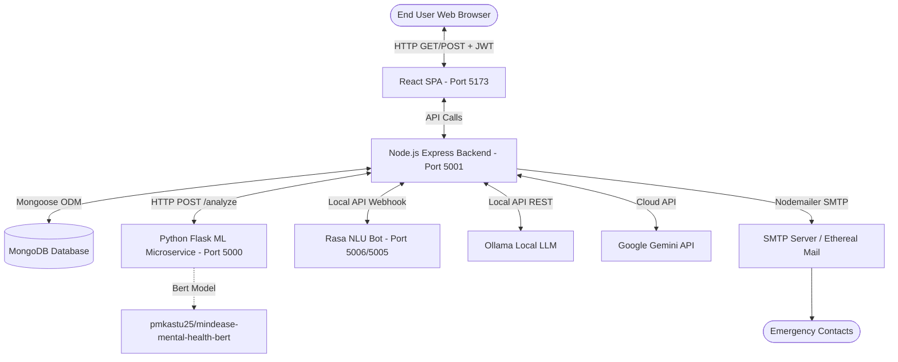
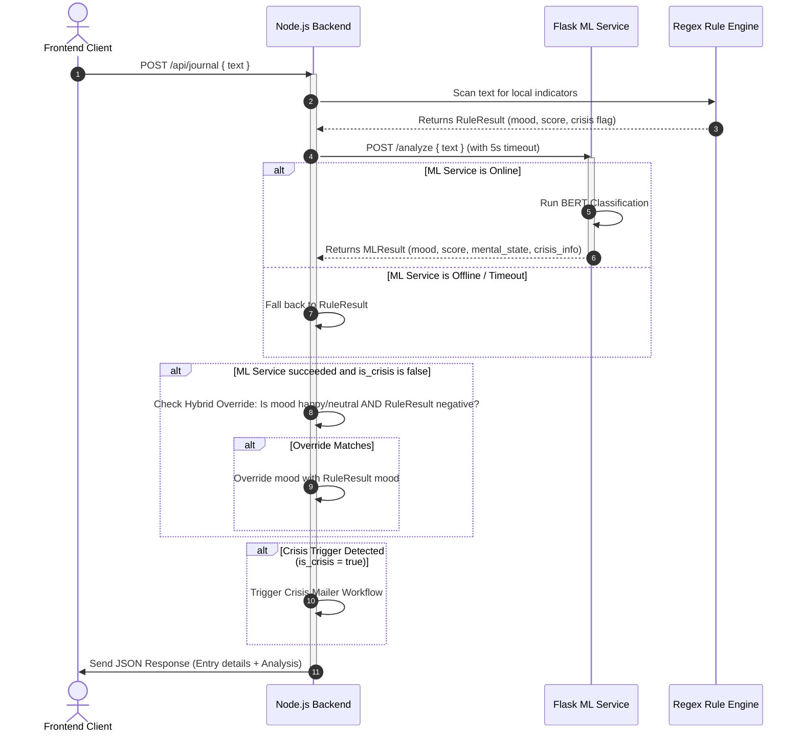
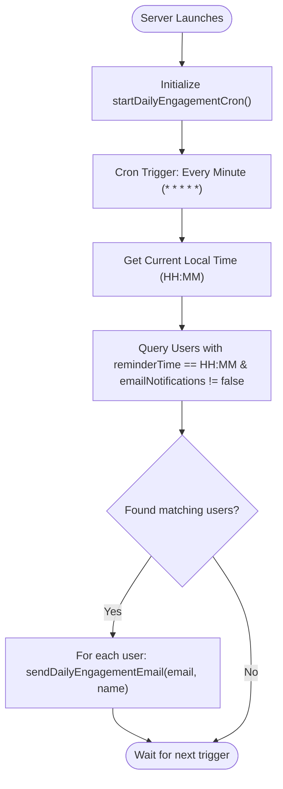

# Software Requirements Specification
## for
# MindEase AI v2 — Emotion-Aware Well-Being Companion

**Version:** 1.0 approved  
**Prepared by:** Antigravity AI  
**Organization:** Google DeepMind Team  
**Date Created:** 2026-06-16  

---

## Table of Contents
* [Revision History](#revision-history)
* [1. Introduction](#1-introduction)
  * [1.1 Purpose](#11-purpose)
  * [1.2 Document Conventions](#12-document-conventions)
  * [1.3 Intended Audience and Reading Suggestions](#13-intended-audience-and-reading-suggestions)
  * [1.4 Product Scope](#14-product-scope)
  * [1.5 References](#15-references)
* [2. Overall Description](#2-overall-description)
  * [2.1 Product Perspective](#21-product-perspective)
  * [2.2 Product Functions](#22-product-functions)
  * [2.3 User Classes and Characteristics](#23-user-classes-and-characteristics)
  * [2.4 Operating Environment](#24-operating-environment)
  * [2.5 Design and Implementation Constraints](#25-design-and-implementation-constraints)
  * [2.6 User Documentation](#26-user-documentation)
  * [2.7 Assumptions and Dependencies](#27-assumptions-and-dependencies)
* [3. External Interface Requirements](#3-external-interface-requirements)
  * [3.1 User Interfaces](#31-user-interfaces)
  * [3.2 Hardware Interfaces](#32-hardware-interfaces)
  * [3.3 Software Interfaces](#33-software-interfaces)
  * [3.4 Communications Interfaces](#34-communications-interfaces)
* [4. System Features](#4-system-features)
  * [4.1 User Authentication and Profile Management](#41-user-authentication-and-profile-management)
  * [4.2 AI-Powered Emotional Journaling](#42-ai-powered-emotional-journaling)
  * [4.3 Interactive CBT Conversations and Fallback Pipeline](#43-interactive-cbt-conversations-and-fallback-pipeline)
  * [4.4 Mood Analytics Dashboard and Keyword Correlation Engine](#44-mood-analytics-dashboard-and-keyword-correlation-engine)
  * [4.5 Wellness Resource Library](#45-wellness-resource-library)
  * [4.6 Therapist Connect](#46-therapist-connect)
  * [4.7 Emergency Crisis Detection and Alerting System](#47-emergency-crisis-detection-and-alerting-system)
  * [4.8 Guided Breathing Tool (4-7-8 Breathing Cycle)](#48-guided-breathing-tool-4-7-8-breathing-cycle)
  * [4.9 Persistent Notification Management System](#49-persistent-notification-management-system)
* [5. Other Nonfunctional Requirements](#5-other-nonfunctional-requirements)
  * [5.1 Performance Requirements](#51-performance-requirements)
  * [5.2 Safety Requirements](#52-safety-requirements)
  * [5.3 Security Requirements](#53-security-requirements)
  * [5.4 Software Quality Attributes](#54-software-quality-attributes)
  * [5.5 Business Rules](#55-business-rules)
* [6. Other Requirements](#6-other-requirements)
* [Appendix A: Glossary](#appendix-a-glossary)
* [Appendix B: Analysis Models](#appendix-b-analysis-models)
* [Appendix C: To Be Determined List](#appendix-c-to-be-determined-list)

---

## Revision History
| Name | Date | Reason For Changes | Version |
| :--- | :--- | :--- | :--- |
| Antigravity AI | 2026-06-16 | Initial draft detailing existing project code features and flow structures | 1.0 approved |
| Antigravity AI | 2026-06-16 | Enhanced with client-side context state logic, Gemini retry, Rasa intent details, breathing widget, and persistent notifications | 1.1 revised |

---

## 1. Introduction

### 1.1 Purpose
This Software Requirements Specification (SRS) details the requirements for **MindEase AI v2**, an Emotion-Aware Well-Being Companion. This document covers the full system architecture, specifically detailing the React 18 frontend Single Page Application (SPA), the Node.js Express REST API backend, and the Python Flask Machine Learning microservice. The scope covers user data logging, dynamic AI evaluations, natural language processing chatbot pipelines, and emergency notification workflows.

### 1.2 Document Conventions
This document follows standard software engineering documentation guidelines. Additional styling conventions:
* **Critical Alerts**: Styled as GitHub markdown blocks (`> [!IMPORTANT]`, `> [!WARNING]`).
* **Functional Requirements**: Uniquely identifier-tagged using prefix format `REQ-[Feature-Number]-[Incremental-ID]`.
* **Priority Schema**: Functional requirements inherit their priority directly from the parent System Feature level, unless explicitly annotated.

### 1.3 Intended Audience and Reading Suggestions
This SRS is intended for:
* **Software Developers**: To understand component endpoints, schemas, fallback designs, and dependencies.
* **Testers**: To construct verification cases mapping to functional criteria and stimulus/response sequences.
* **Project Managers / Stakeholders**: To evaluate scope boundaries, nonfunctional parameters, and compliance with mental health product disclaimers.

*Reading Sequence Suggestion*: Start with **Section 2** for a high-level product conceptualization, review **Section 3** for system interface details, analyze functional aspects in **Section 4**, and examine structural flows and diagrams in **Appendix B**.

### 1.4 Product Scope
MindEase AI v2 is designed as a secure, personal mental health companion.
* **Key Benefits**: Provides users with immediate, zero-barrier cognitive behavioral support, insights into mood correlations, reflective writing habits, and local clinician search options.
* **Objectives**: Address the high latency and cost of professional clinical therapy by offering a supportive wellness aid. 
* **Corporate Alignment**: Connects to digital health strategies by combining local, privacy-first AI computation models (Ollama, local classifiers) with cloud-based models (Gemini) as secondary endpoints.

### 1.5 References
1. *MindEase Project Repository & Specifications*: [README.md](file:///c:/Users/Prathamesh/Downloads/mindease_ai_v2_organic/mindease2/README.md)
2. *IEEE Standard 830-1998*: Recommended Practice for Software Requirements Specifications.
3. *HuggingFace Model Library*: `pmkastu25/mindease-mental-health-bert` Fine-Tuned Model.
4. *External API Coordinates*: `THERAPIST_API_URL` Interface Definitions.

---

## 2. Overall Description

### 2.1 Product Perspective
MindEase AI v2 is a self-contained, three-tier emotional wellbeing application. It acts as an upgrade from Version 1 by replacing purely rule-based analysis pipelines with a hybrid architecture. The client-side React SPA communicates via HTTP REST calls using secure JSON Web Tokens. The Node.js Express backend connects to a MongoDB database to read and write records, proxying complex Natural Language Processing (NLP) requests to the Python Flask ML Service, local Ollama endpoints, cloud Gemini instances, or external Rasa NLU webhook nodes.

### 2.2 Product Functions
The main product functions include:
* **User Authentication & Profile Configuration**: Creating accounts, managing JWT tokens, and editing notifications, daily reminder times, and emergency contacts.
* **AI Sentiment Journaling**: Processing journal logs to extract emotional states, determine numeric scores (0 to 1), and return cognitive exercises.
* **CBT Chatbot Pipeline**: An interactive chat interface backed by a multi-tier fallback architecture.
* **Well-being Analytics**: Generating consecutive activity streaks, calendar heatmaps, and identifying positive/negative triggers.
* **Wellness Library**: A filterable repository of guided exercises (CBT Thought Records, Grounding Rituals, 4-7-8 Breathing) accompanied by mood-informed dynamic banners and external visual/audio links.
* **Therapist Connect**: Locating and viewing professional clinicians relative to user distance and specialties.
* **Crisis Safety Alert System**: Dispatching alerts to saved emergency contacts when the system detects signs of a mental health crisis.
* **Interactive Breathing Tool**: Providing real-time guided breathing cycles.
* **Persistent Notification System**: Keeping track of system milestones and updates.

### 2.3 User Classes and Characteristics
* **Standard Registered Users**: Individuals looking to track and manage their emotional well-being. They possess average technical skills and require a responsive, clean, and highly secure interface.
* **Designated Emergency Contacts**: Family members, parents, or guardians who receive automated notifications if a user experiences severe emotional distress.
* **System Administrators**: Technical operators managing backend environments, API connections, and SMTP settings.

### 2.4 Operating Environment
* **Web Client**: Compatible with modern browsers (Chrome 100+, Safari 15+, Firefox 98+, Microsoft Edge 100+).
* **Application Backend**: Node.js v18.0.0 or higher.
* **Machine Learning Environment**: Python 3.9+ running PyTorch 2.0+ and HuggingFace Transformers.
* **Database**: MongoDB v6.0+ (local instance or MongoDB Atlas Cloud clusters).

### 2.5 Design and Implementation Constraints
* **Local Fallback Operations**: If ML microservices or external APIs go offline, the server must fall back to local rule-based evaluations and scripted templates.
* **Data Privacy Limits**: User journals and chats contain sensitive personal data. They must be protected using industry-standard hashing and secure transport strategies.
* **SMTP Settings**: Outbound safety alert emails fallback to Ethereal sandbox test servers if production SMTP details are missing.

### 2.6 User Documentation
The product will deliver the following documentation:
* **API Documentation**: Detailed routing descriptions and JSON schemas.
* **Contextual Help**: Expandable visual modules explaining CBT records, breathing steps, and exposure therapies.
* **Safety Disclaimers**: Static notices reminding users of the app's limitations as a wellness tool rather than a clinical provider.

### 2.7 Assumptions and Dependencies
* **Model Availability**: Assumes HuggingFace model servers are accessible during setup to download `pmkastu25/mindease-mental-health-bert`.
* **API Integrations**: Access to Ollama locally and Google Gemini endpoints in the cloud is required for LLM chat operations.
* **Network Reliability**: Real-time crisis mail delivery relies on stable outbound SMTP servers.

---

## 3. External Interface Requirements

### 3.1 User Interfaces
* **Visual Palette**: Organic colors, including Sage Green (`#7c9e8a`), Lavender (`#9b8ec4`), Blush Pink (`#e8b4b8`), Sky Blue (`#8ab4c8`), and Cream Base (`#faf7f2`).
* **Design Pattern**: Glassmorphism cards with `rgba(255,255,255,0.82)` background, modern typography (*Playfair Display* for titles, *DM Sans* for body copy), and micro-animations.
* **Structure Layout**: Sticky sidebar navigation component (`Navbar.jsx`), top header component (`Topbar.jsx`), and dedicated sections for Analytics, Journaling, Chatbot, Resources, and Therapist Connect.

### 3.2 Hardware Interfaces
The software does not connect directly to specialized hardware devices. It operates on standard server nodes (CPU/GPU environments supporting PyTorch models) and client systems running standard web browsers.

### 3.3 Software Interfaces
* **Database Driver**: MongoDB connection managed using the Mongoose ODM framework.
* **ML Model Framework**: Python Flask uses HuggingFace Tokenizers and the `BertForSequenceClassification` interface.
* **LLM Orchestration**:
  * **Ollama Client**: Queries local instances running on standard port `http://127.0.0.1:11434` with configurable temperature (0.7) and default target model `llama3`.
  * **Google Gemini SDK**: Queries `gemini-2.5-flash` model.
* **Mail Client**: Nodemailer package manages SMTP connectivity.
* **External Therapist Directory**: Fetches lists via HTTP GET from the specified `THERAPIST_API_URL`.

### 3.4 Communications Interfaces
* **Application Communication**: Uses HTTP/HTTPS protocols with JSON payloads.
* **Rasa Integration**: Connects via webhook calls using the `/webhooks/rest/webhook` API. Supports semantic intents including `anxiety`, `loneliness`, `sleep_problem`, `motivation_low`, `breathing_help`, and `ask_resources`.
* **Email Protocols**: Nodemailer dispatches safety notifications over SMTP (typically port 587/465).

---

## 4. System Features

### 4.1 User Authentication and Profile Management
#### 4.1.1 Description and Priority
Allows users to create accounts, log in, and manage their preferences, notifications, and emergency contacts.
* **Priority**: High.

#### 4.1.2 Stimulus/Response Sequences
* **Register Account**:
  * *Stimulus*: User submits username, email, password, gender, and contact list.
  * *Response*: System creates the account, hashes the password, sends a welcome email, and returns a signed JWT.
* **Edit Preferences**:
  * *Stimulus*: User updates notification preferences or reminder times.
  * *Response*: System updates the MongoDB user document, caches the configuration locally in `localStorage`, and sends a confirmation.

#### 4.1.3 Functional Requirements
* **REQ-1.1**: The system must hash passwords using `bcryptjs` with 12 salt rounds before database insertion.
* **REQ-1.2**: Registered accounts must be unique by email address (case-insensitive check).
* **REQ-1.3**: The system must issue a JSON Web Token (JWT) with a 30-day validity upon successful login or registration.
* **REQ-1.4**: Users must be able to specify two types of emergency contacts: `parentalContacts` (email-only) and `otherContacts` (name, email, and relation type).
* **REQ-1.5**: Profile schemas must support custom daily reminder times in `"HH:MM"` format, defaults to `"09:00"`.
* **REQ-1.6**: Client-side state must be managed via `AuthContext.jsx` and persisted within `localStorage` as `"mindease_token"` and `"mindease_user"`.

---

### 4.2 AI-Powered Emotional Journaling
#### 4.2.1 Description and Priority
A writing workspace that analyzes user logs for emotional states, scores confidence levels, and displays coping strategies.
* **Priority**: High.

#### 4.2.2 Stimulus/Response Sequences
* **Submit Entry**:
  * *Stimulus*: User types a journal entry (>10 characters) and clicks "Analyze".
  * *Response*: System processes the entry, updates past logs, displays the analyzed mood, confidence percentage, and suggests a matching coping exercise.

#### 4.2.3 Functional Requirements
* **REQ-2.1**: The system must reject journal submissions under 10 characters.
* **REQ-2.2**: The system must evaluate entries using the Flask ML model, returning a classification label and a confidence score between 0 and 1.
* **REQ-2.3**: If the ML service is offline, the backend must fall back to a local Regex-based keyword scanner.
* **REQ-2.4**: The system must override ML classifications of "Normal" or "Normal (happy)" if the local Regex engine detects clear negative keywords (e.g. "sad", "anxious", "angry").
* **REQ-2.5**: The system must save the raw predicted label as `mental_state` and the mapped value (`happy`, `calm`, `neutral`, `anxious`, `sad`, `angry`) as `mood` in the journal record.

---

### 4.3 Interactive CBT Conversations and Fallback Pipeline
#### 4.3.1 Description and Priority
A conversational interface that provides cognitive behavioral therapy (CBT) guidance, using a five-tier fallback architecture.
* **Priority**: High.

#### 4.3.2 Stimulus/Response Sequences
* **Submit Message**:
  * *Stimulus*: User sends a message in the chat window.
  * *Response*: The system evaluates the input through the fallback hierarchy, records the conversation, and returns the response with the detected mood.

#### 4.3.3 Functional Requirements
* **REQ-3.1**: The system must execute a five-tier fallback check for incoming user chat messages:
  1. *Tier 1*: Hard local bypass for greetings/thanks (e.g. "hi", "thank you").
  2. *Tier 2*: Query local Ollama service (CBT-tuned model).
  3. *Tier 3*: Query Google Gemini API (if Ollama fails or is offline).
  4. *Tier 4*: Query Rasa Webhook endpoint (if Gemini fails or API keys are missing).
  5. *Tier 5*: Load static, mood-matched CBT template scripts (if all other tiers fail).
* **REQ-3.2**: The system must prompt LLM endpoints (Ollama/Gemini) to act as a "compassionate CBT-based mental health companion" who responds with empathy and support.
* **REQ-3.3**: The system must store all user and bot messages in the database, linked to the user's session identifier.
* **REQ-3.4**: The frontend chatbot UI must parse markdown formatting including bold text (`**bold**`), italicized text (`*italics*`), and multi-line bullet lists (`-`, `•`, `*` or numbered).
* **REQ-3.5**: The frontend chatbot UI must support quick reply suggestion chips (e.g., "😰 I'm feeling anxious today", "🧘 Guide me through breathing").

---

### 4.4 Mood Analytics Dashboard and Keyword Correlation Engine
#### 4.4.1 Description and Priority
Aggregates user data to visualize emotional trends, streaks, and calculate correlations between activities and mood states.
* **Priority**: Medium-High.

#### 4.4.2 Stimulus/Response Sequences
* **Load Analytics**:
  * *Stimulus*: User opens the Analytics page.
  * *Response*: System calculates and displays emotional streaks, mood breakdown charts, and lists the user's top mood boosters and stressors.

#### 4.4.3 Functional Requirements
* **REQ-4.1**: The system must calculate check-in streaks based on daily user interactions (journals and chat messages).
* **REQ-4.2**: The system must generate a monthly heatmap array containing average daily scores (0 to 1), `-1` for days with no activity, and `null` for calendar padding.
* **REQ-4.3**: The system must parse journal content against five keyword categories: *Family & Friends*, *Exercise & Activity*, *Work & Studies*, *Rest & Sleep*, and *Nature & Outdoors*.
* **REQ-4.4**: The system must calculate mood correlations by comparing the average score of keyword-matched entries against the user's overall average. Positive variance flags a **Booster**, while negative variance flags a **Stressor**.
* **REQ-4.5**: If keyword data is insufficient, the system must display default, research-backed booster and stressor correlations.

---

### 4.5 Wellness Resource Library
#### 4.5.1 Description and Priority
A filterable library containing guided mental wellness exercises, dynamically tailored to the user's dominant mood.
* **Priority**: Medium.

#### 4.5.2 Stimulus/Response Sequences
* **Open Resources**:
  * *Stimulus*: User clicks on the Resources tab.
  * *Response*: The system displays exercises, quick tips, and updates the top banner to recommend coping strategies based on the user's weekly mood.

#### 4.5.3 Functional Requirements
* **REQ-5.1**: The system must allow users to filter resources by categories: *All*, *Mindfulness*, *Anxiety*, and *CBT*.
* **REQ-5.2**: The system must display a dynamic top banner tailored to the user's dominant mood (e.g. recommending grounding exercises for `anxious` states, and self-compassion guides for `sad` states).
* **REQ-5.3**: Resources must include expandable sections containing step-by-step instructions (e.g. 4-7-8 Breathing, 5-Min Grounding Ritual, Thought Records) and external links to YouTube audios or articles.

---

### 4.6 Therapist Connect
#### 4.6.1 Description and Priority
A clinician directory page that connects users with nearby professional therapists, showing locations, reviews, fees, and contact details.
* **Priority**: Medium.

#### 4.6.2 Stimulus/Response Sequences
* **Search Therapist**:
  * *Stimulus*: User accesses the therapist connect tab or filters by tag (e.g. "Anxiety").
  * *Response*: The system displays matching profiles, including availability, fees, ratings, reviews, addresses, and map links.

#### 4.6.3 Functional Requirements
* **REQ-6.1**: The system must fetch therapist records from `THERAPIST_API_URL` or load a local database of 9 professional profiles if the API is unconfigured.
* **REQ-6.2**: Therapist profiles must contain coordinates (latitude and longitude) to support mapping.
* **REQ-6.3**: Users must be able to filter search results by tags (e.g. Couple Therapy, PTSD, ADHD, Mindfulness) and availability status.

---

### 4.7 Emergency Crisis Detection and Alerting System
#### 4.7.1 Description and Priority
A safety-net feature that monitors user inputs for self-harm indicators, alerting their designated emergency contacts and displaying crisis helplines.
* **Priority**: Critical.

#### 4.7.2 Stimulus/Response Sequences
* **Distress Detected**:
  * *Stimulus*: User submits a journal or message containing self-harm keywords or the ML model predicts a "Suicidal" or "Depression" label.
  * *Response*: The system immediately triggers the crisis flow, dispatches email alerts to the user's emergency contacts, and shows the crisis support modal.

#### 4.7.3 Functional Requirements
* **REQ-7.1**: The system must scan chat inputs and journal entries for self-harm keywords (`suicid`, `kill myself`, `end my life`, `self.harm`, `hurt myself`, `cutting`, `hopeless`).
* **REQ-7.2**: The system must trigger the crisis alert if the ML model classifies the entry with a label of `Suicidal` or `Depression`.
* **REQ-7.3**: When triggered, the backend must asynchronously email all contacts in the user's `parentalContacts` and `otherContacts` lists using Nodemailer.
* **REQ-7.4**: Crisis emails must dynamically adjust relationship terms based on the user's gender configuration:
  * *Male* -> "son"
  * *Female* -> "daughter"
  * *Other/Prefer not to say* -> "child"
* **REQ-7.5**: The safety email must include the user's name, the distress quote, advice on how to respond, and active national helpline numbers (iCall, Vandrevala Foundation).
* **REQ-7.6**: The frontend must show a `CrisisModal` overlay showing:
  * A random quote chosen from a pool of 10 motivational sayings, avoiding consecutive repetition.
  * A card-grid indicating specific supportive actions for friends and family.
  * Immediate click-to-dial buttons for iCall and Vandrevala Foundation.
  * A 10-second countdown progress bar that automatically redirects the user to the Therapist Connect page (`therapist`) at `0s`.
  * An descriptive notification banner indicating whether email alerts were sent successfully.

---

### 4.8 Guided Breathing Tool (4-7-8 Breathing Cycle)
#### 4.8.1 Description and Priority
A breathing widget that guides the user through the 4-7-8 breathing technique using visual instructions and timing intervals.
* **Priority**: Low-Medium.

#### 4.8.2 Stimulus/Response Sequences
* **Start Breathing**:
  * *Stimulus*: User clicks "Start breathing guide" or select the "Guide me through breathing" prompt.
  * *Response*: The system locks focus, disables configuration buttons, and displays visual text changes corresponding to the inhalation, breath retention, exhalation, and rest phases.

#### 4.8.3 Functional Requirements
* **REQ-8.1**: The system must execute a 4-7-8 breathing sequence consisting of five states: "Inhale... 🫁" (4 seconds), "Hold..." (7 seconds), "Hold..." (repeated), "Exhale... 😮‍💨" (8 seconds), and "Pause..." (rest).
* **REQ-8.2**: The system must disable trigger triggers while the breathing cycle is running to prevent phase interruptions.
* **REQ-8.3**: The sequence must run for 4 full cycles before returning to an idle state.

---

### 4.9 Persistent Notification Management System
#### 4.9.1 Description and Priority
A notification system that records and keeps track of system milestones, journal evaluations, and chat responses.
* **Priority**: Low.

#### 4.9.2 Stimulus/Response Sequences
* **Show Notifications**:
  * *Stimulus*: User clicks the notification icon.
  * *Response*: The system lists past milestones, unread counts, and allows clearing them.

#### 4.9.3 Functional Requirements
* **REQ-9.1**: The system must persist notification logs locally in `localStorage` as `"mindease_notifications"`.
* **REQ-9.2**: Notifications must contain fields: `id`, `title`, `message`, `type`, `createdAt`, and `read`.
* **REQ-9.3**: The system must automatically record notifications when:
  * A new journal entry is successfully analyzed.
  * An AI response is received from the companion.
  * A new account is successfully registered.

---

## 5. Other Nonfunctional Requirements

### 5.1 Performance Requirements
* **Response Latency**: Sentiment analysis evaluations must complete within 5 seconds (`timeout: 5000ms`).
* **Cron Dispatch**: The background cron job must check user preferences every minute to ensure emails are sent at the user's preferred time.
* **Database Performance**: Use indexes on `user` and `createdAt` fields to keep query times for journals and chats under 200ms.

### 5.2 Safety Requirements
* **Crisis Prevention**: The system must ensure crisis emails are sent asynchronously to avoid blocking user interaction or delaying emergency helpline resources.
* **Accuracy Threshold**: The hybrid override rule must take precedence over ML predictions of "Normal" or "Neutral" if negative keyword matches are found.

### 5.3 Security Requirements
* **Password Security**: Passwords must be hashed using `bcryptjs` with 12 salt rounds before storage.
* **API Access**: All API endpoints except login and registration must require a valid JWT in the HTTP Authorization header.
* **Cross-Origin Protection**: Restrict CORS access to the specified client URL to protect user sessions from cross-site scripts.

### 5.4 Software Quality Attributes
* **Availability**: If the ML service is offline, the system must degrade gracefully by falling back to local rule-based evaluations.
* **Reliability**: If the local Ollama LLM is unavailable, the chat pipeline must automatically fall back to cloud Gemini endpoints, Rasa webhooks, or static templates.
* **Gemini Retries**: The Gemini connection must catch HTTP 429 rate limits and execute up to 3 retries using exponential backoff (1000ms delay doubled on each failure).
* **Usability**: The design must follow responsive web guidelines, adapting to desktop and mobile screens.

### 5.5 Business Rules
* **User Consent**: Automated engagement emails are only dispatched to users who have set `emailNotifications` to true.
* **Emergency Dispatch Limits**: The system must send crisis alerts immediately, regardless of user notification configurations, to prioritize user safety.

---

## 6. Other Requirements
* **Database Schema Configuration**: The Mongoose database models must support timestamps to track creation and update logs.
* **Internationalization**: The default interface language is English (en-IN date localization).

---

## Appendix A: Glossary
* **CBT**: Cognitive Behavioral Therapy.
* **JWT**: JSON Web Token.
* **BERT**: Bidirectional Encoder Representations from Transformers.
* **SMTP**: Simple Mail Transfer Protocol.
* **Rasa**: Open-source conversational NLU framework.
* **Ollama**: Framework for running LLMs locally.
* **Nodemailer**: Node.js module used for sending emails.

---

## Appendix B: Analysis Models

### B.1 Complete System Architecture

### B.2 Sentiment Analysis & Override Flow

### B.3 Dynamic Daily Engagement Scheduling

---

## Appendix C: To Be Determined List
1. *External API Integration*: Configuration parameters and authorization protocols for `THERAPIST_API_URL` once the clinician API goes live in production environments.
2. *Rasa Production Endpoint*: Transitioning the default local hook URLs (`http://localhost:5006` or `http://localhost:5005`) to production servers.
